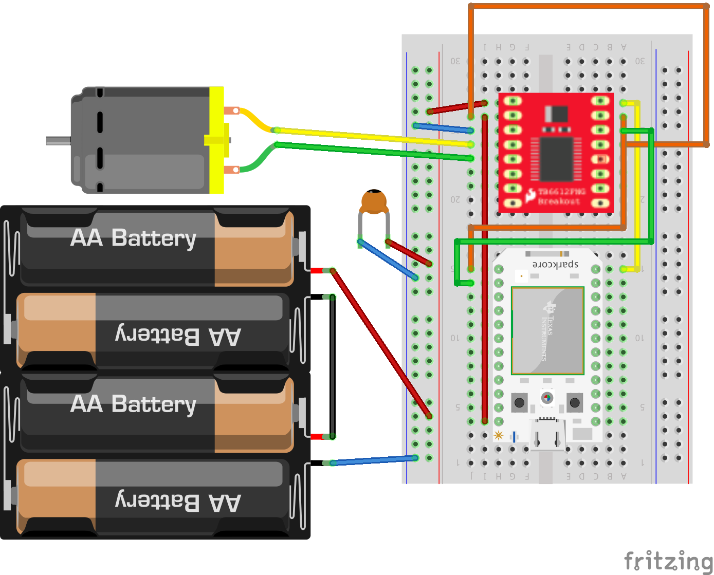

# Tips and Tricks for Building your Tamiya-Powered Boat!

The Motor-Powered boat is actually driven by the Tamiya-Motor pod, a submersible pod. The trick is, the motor pod normally can't be controlled externally. We'll need to modify the motor pod to be able to connect it to the Particle Core and control the speed and direction of your boat.

Take note! This build does require soldering! Ask for help if you need it, but if you're looking for a non-soldering boat build, take a look over at the [Paddle Boat design](paddleboat.md).

### Modifying the Motor Pod

In order to control the motor pod, you'll have to solder two wires to the motor itself. As it turns out, jumper wires are perfect for this purpose! Take two longer ones from your Particle kit, and strip one end off of each. Then solder each wire to one of the leads protruding from the motor. You want to position the wires so that the long ends are against the body of the motor, pointing backwards towards the spindle/propeller end of the motor. Make sure the exposed metal of the wires don't touch the metal of the motor! This could cause a short. If you think it's a risk, you can use a piece of tape to insulate the body of the motor.

Once your wires are soldered in place, it's a good idea to make sure your motor is working as anticipated. Touch the ends of the wires to the ends of a battery. If the motor spins, it was soldered properly!

Next, you'll need to find the blue clip that came with the motor kit (it looks like a ring with a clip on the end), the small rubber ring, and the tube of grease. Snap the ring onto the motor - it should fit snugly over the white, plastic end of the motor. It will help hold the motor in place inside the pod. Next, place the rubber ring onto the spindle of the motor, adding some grease between the motor and the ring. Dont' use up all the grease, you'll need some more later.

Once the clip and rubber ring are in place, insert the motor into the back half of the pod, with the blue clip facing the open end, and the motor's spindle facing the tail of the pod. You'll want to hold the two soldered wires in place so that they are doubled back over the top of the clip, facing towards the center of the pod. It's a tight fit, but the jumper wires should fit snugly and securely through a small gap. Push the motor in until the spindle protrudes from the back of the pod. Take the blue plastic propeller and add it to the end of the spindle.

Now it's time to make an exit point for the wires connected to the motor! Figure out how you want to position your motor pod on your boat, and drill a hole in the front half of the motor pod, where you want your wires to exit. Feed your wires through, and you can close up the motor pod, using some more of the grease in the seam.

Finally, gently pull your wires and use the waterproof sealant to close up the gaps in the hole you drilled. Set it aside to dry.

### Sparkfun Motor Driver

The motor draws too more power than the Particle can provide, so you'll need to use a motor driver to be able to bring in an external source of power. We'll be using the Sparkfun motor driver for this! First step, you'll need to solder the headers onto the driver so that you can connect it to your breadboard.

The following diagram shows how you can wire up the driver once it's soldered. The driver can actually support two motors, but this is showing the wiring for just one:

All the wires can get a little confusing, so here's a breakdown (the pins are all labelled on one side of the driver):
- VM: goes to the battery power
- VCC: goes to the 3V3 from the Particle
- GND: goes to ground
- A01: goes to the other motor's wires (motors are bi-directional, so which goes where doesn't matter)
- A02: goes to one of the motor's wires
- PWMA: goes to a pulse width module pin on the Particle Core to control the motor's speed
- AIN1: goes to the Particle to control forward/reverse movement
- AIN2: goes to the Particle to control forward/reverse movement
- STBY: goes to the 3V3 power from the Particle

#### Wiring Tips
- If you do not have power going to the STBY pin on the motor driver, the motor will not move. This pin acts as an emergency brake of sorts. If you want to, you can implement this, but since most boats don't need an emergency brake you can just give it power to bypass it.
- If you use a servo for steering your boat, keep in mind that A0 and A1 are on the same timer peripheral. This means that you cannot have two different types of components connected to these. Eg: you can have a servo on A0 and another servo on A1 because they require the same timing, but having a motor on A0 and a servo on A1 would cause a malfunction.
- Motors are bi-directional, so if you realize your forward is going in reverse and vice versa, you can simply switch the pins for dir and cdir in the code!

### General Tips

- Before drilling a hole in the boat hull to pass through the wires from the motor pod, it is strongly recommended that you put all of your components in the boat first, to test the bouyancy and add the appropriate amount of styrafoam to the boat.
- You'll drill and seal a hole in your boat hull for the wires similar to how you drilled and sealed the hole in the motor pod. Make sure you allow enough time for the glue to dry before your boat goes into the water!
- The rudder that comes with the Tamiya kit is too small to steer the boat well. Use the mini servo to create a rudder that you can make out of popsicle sticks! Just make sure that you attach the servo itself to the boat. If you accidentally glue the label instead of the servo body, it may fall off when it gets wet!
- Servos are not waterproof! Make sure to keep them out of the water!
- If you need to extend any jumper wires, we have heat shrink tubing which can form a watertight seal and help you join them.