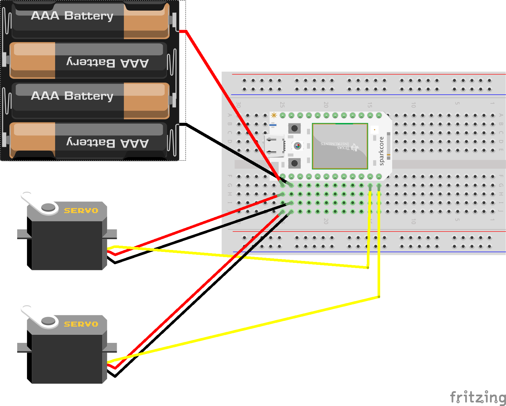
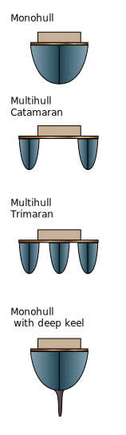

# Tips and Tricks for Building your Paddle Boat!

The Paddle Boat design is a boat that has two servos to propel and steer the boat, acting almost as wheels. Paddles can be added on to the servos through the use of 3D printed objects, popsicle sticks, and whatever else is deemed useful. Here are some tips and tricks (and wiring diagrams) to help you make your Paddle Boat a success!

## Wiring Diagram

## Considerations when choosing a hull configuration

The hull is the watertight body of your boat that keeps it from sinking and can be broken into two configurations: monohull and multihull. A monohull has a single body, and is the most common type of hull. Multihulls, most of which are called catamarans (two hulls) or trimarans (three hulls), use more than one hull with a structure that holds them together.

There are many pros and cons to each type of hull, but the tl;dr is that monohulls are easier to build, while multihulls are more stable on the water and less likely to capsize.

Monohull
- Spacing between paddles is determined by the width of the hull
- Servos are mounted inside the hull body
    - You may need some sort of axle to connect the paddle to the motor

Catamaran
- Each paddle can be connected to the inside or outside of each hull
- Alternatively, they can be suspended from the connecting structure
    - A housing mechanism will need to be built to shield the electronics from splashing water

Trimaran
- The middle hull has the same considerations as monohulls
- The paddles need to be small enough to fit between the support beams for the two outer hulls

## Other considerations

Determining how high to mount the servo is a balancing act

- The center of the servo needs to be low enough so that the paddles get good contact with the water
- At the same time, it needs to be high enough to not let water inside the hull

Weight distribution

- Try and get the weight of everything inside of the hull(s) to balance evenly between the front/back and left/right.
- Unbalanced boats increase the risk of capsizing and also make them less likely to travel in a straight line
- Try and align the servos as close as possible
    - Misalignment can also result in the boat not moving in a straight line
    - Make sure they are at the same height, distance from the front, and at the same angle

Miscellaneous

- Duct tape is pretty much waterproof as long as it is laid out evenly.
    - Creases in the tape can allow water on the underside of the tape, causing it to leak and/or come off
- If the paddles are made out of popsicle sticks, you may want to consider coating them so they don't get too waterlogged too quickly.
- Make sure the paddles are as close as possible to being identical. Differences in length/width of the individual blades can cause the boat to not move in a straight line
- If you are using the food containers for your hull, make sure that the paddles clear the lip of the container
- Hot glue is designed to melt plastic (of course), which includes the food containers. Try adding as little glue as possible to the food containers, and add it in batches/layers to prevent the container from deforming
- Depending on your hull configuration, you may be able to use a Pawel Bot to mount your servos, drastically simplifying alignment of the servos
